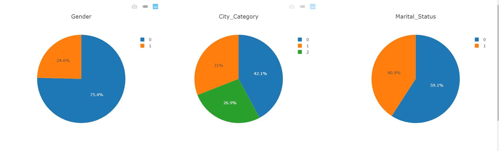
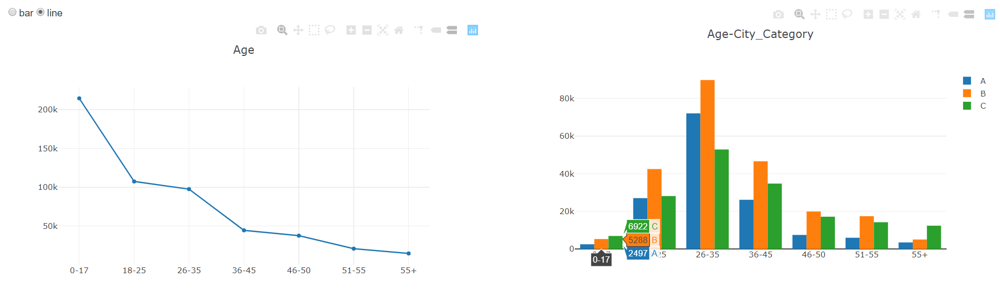
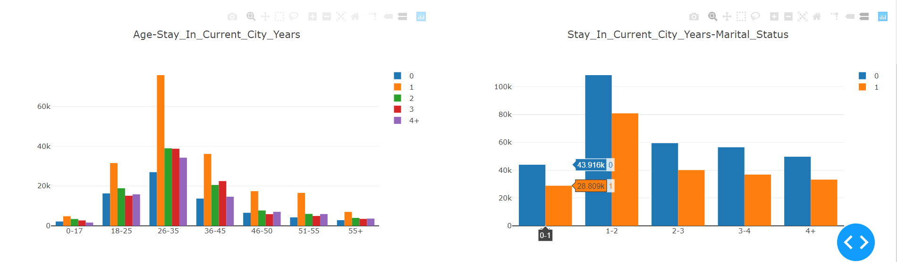
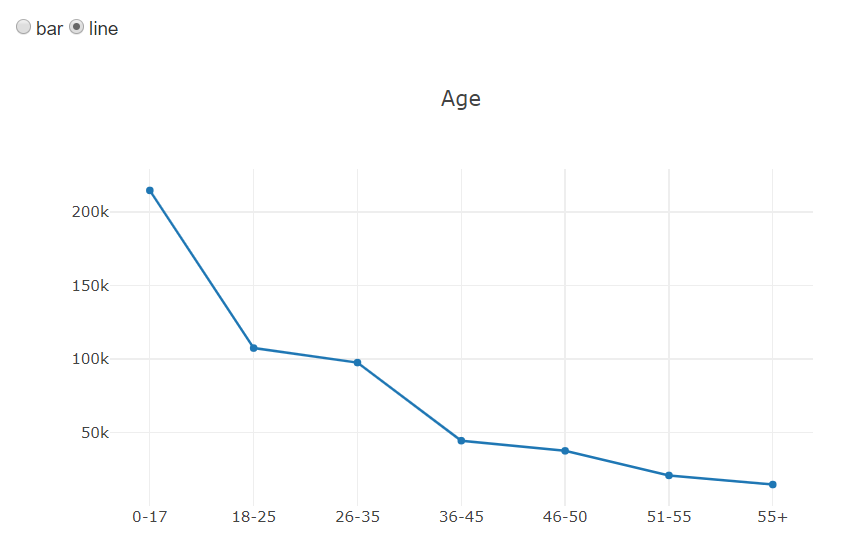
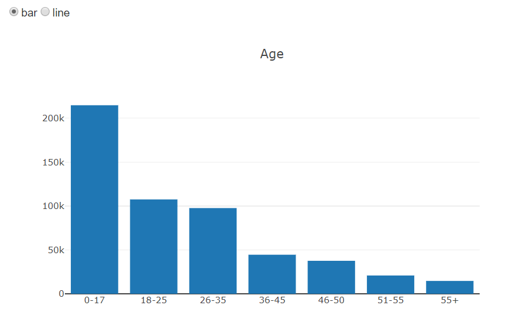

# 1 Project Overview

## 1.1 Project Description

 Based on pandas and dash，design and implement a Dashboard for a dataset.

## 1.2 Project function requirements

 The dashboard should contain at least three graphs (e.g. scatter plot, bar chart, pie chart, line chart, etc) which reveal certain information respectively

•It’s not necessary to visualize all the columns/rows of the dataset. You can choose only several of them.

•An example

# 2 Design and implementation

## 2.1 Design

### 2.1.1 the file directory structure :

├── datasets
│       └── BlackFriday.csv
├── Data Visualization.py
└── readme

### 2.1.2 Data analysis and processing

#### •Describe a data analysis task for the  dataset

(objectives, characteristics of the dataset, etc);

##### objective：

It mainly analyzes and processes the user information in the dataset, analyzes the distribution information of the user's gender, marital status, living city and age, and analyzes the relationship between them.

##### characteristics of the dataset：

The data set has a large amount of data, and the data relating to the user's information is relatively easy to quantify. However, due to the large amount of data, it is difficult to describe the data relationship by the distribution of each individual user using the scatter plot. Therefore, the bar chart, the pie chart and the line graph are used to simply describe the distribution of the user on different features.

#### •Describe the layout of designed dashboard and briefly describe the patterns revealed in the figures.

The design of the dashboard is divided into three rows.

Three pie charts are in the first row, which describe the distribution of the user's gender, marital status, and the type of residential city.

The second row describes the age distribution of the user and the relationship between age and type of city in which they live. Among them, the age distribution can be selected as two description modes, which are a bar chart and a line chart.

The third row describes the relationship between age and years of residence in the current city and the relationship between the number of years of residence in the current city and marital status.

## 2.2 Implementation

### 2.2.1 Code implementation

#### Overall arrangement:

```python
app.layout = html.Div([
   row1,
   row2,
   row3,
])
```

#### Callback function of RadioItems:

```python
@app.callback(
    Output('Age', 'figure'),
    [Input('bar_line', 'value')])
def update_graph(bar_line):
    if bar_line == 'bar':
        return {
            'data': [go.Bar(
                x=df['Age'].sort_values().unique(),
                y=df['Age'].sort_values().value_counts(),
            )],
            'layout': go.Layout(
                title='Age',
        )
        }
    elif bar_line == 'line':
        return {
            'data': [go.Line(
                x=df['Age'].sort_values().unique(),
                y=df['Age'].sort_values().value_counts(),
            )],
            'layout': go.Layout(
                title='Age',
            )
        }
```


### 2.2.2 Interface implementation

#### Row1：



#### Row2：



#### Row3：



# 3 how to run

#### Start

Run the Data Visualization.py file to start the server

Start the search engine by typing 127.0.0.1:8505 in the browser.

#### Select bar or line：

Select the mode of the age graph:



